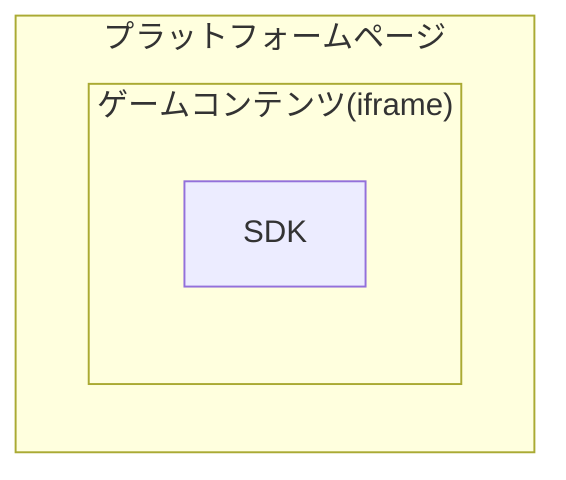

Webゲーム向け開発ガイド
======

NOTE: このドキュメントは、WebゲームでSDKのAPIを呼び出す方法について説明します。主に初期化、ログイン、決済などのインターフェースが含まれます。

## アーキテクチャ


- **プラットフォームページ**: ゲームを読み込むコンテナ。ログイン画面や決済画面などのUIを描画を担います。
- **ゲームコンテンツ**: `iframe`の中で実行されるゲーム本体。
- **SDK (`xsdk.js`)**: ゲーム側が直接触れるSDKのファイル。UIは持たず、APIを使ってプラットフォームページとの通信に徹します。

依存関係の組み込み
-------

ゲームのページが読み込まれる前、およびSDK APIが呼び出される前に、SDKのJSファイル「xsdk.js」を組み込んで読み込みます。「xsdk.js」の完全なURLアドレスを直接参照してください（JSファイルをローカルにダウンロードしないでください）。JSファイルの完全なURLアドレスについては、営業担当者にお問い合わせください。

例えば、メインファイル `index.html` で参照する場合：

```html
<script src="https://oss.bytesdk.com/h5/xsdk.js"></script>
```


必須インターフェース
-------

#### 初期化（必須）

初期化は、ゲーム画面のレンダリングが完了した後、またはゲームリソースの読み込みが完了した後に呼び出す必要があります。また、ログアウトとアカウント切り替え成功時のコールバックを設定できます。

```js
window.XSDKApi.init(function(data) {
  console.log('sdk init success:', data)

  // ログアウトコールバックを設定
  window.XSDKApi.setLogoutCallback(function() {
    console.log('logout from sdk. in game_test.html')
  });    
});
```

#### ログインインターフェース（必須）

```js
window.XSDKApi.login(function(loginResult) {
  console.log('login result called:', loginResult)
})
```

`loginResult`オブジェクトの構造

| キー名 | 説明 |
| :--- | :--- |
| code | ステータスコード (1: 成功, 0: 失敗) |
| msg | エラーメッセージ |
| data | ユーザーデータ |

`data` オブジェクトの構造

| キー名 | 説明 |
| :--- | :--- |
| uid | ユーザーID |
| name | ユーザー名 |
| token | セッショントークン |

#### ログアウトインターフェース（任意）

```js
window.XSDKApi.logout()
```

#### 拡張データの送信（必須）

```js
const roleData = {
  serverID: '1',
  serverName: 'H5デモサーバー',
  roleID: '100',
  roleName: 'キャラクター_&#@!%^_+·~|{}[]',
  roleLevel: '1',
  vip: '1',
  moneyNum: 0,
  createTime: parseInt("" + new Date().getTime()/1000),
  lastLevelUpTime: parseInt("" + new Date().getTime()/1000)
};

if (createRole) {
  roleData.type = 1       //キャラクター作成タイプ
} else {
  roleData.type = 2       //ゲーム参加タイプ、3：レベルアップ、4：ゲーム終了
}

window.XSDKApi.submit(roleData, function(result) {
  if (result && result.code == 0) {
    console.log('role submit success')
  } else {
    console.log('role submit failed')
  }
}) 

```
このメソッドは、呼び出しのタイミングをいくつかのタイプに分類します：


1. キャラクター作成
2. ゲーム参加
3. レベルアップ
4. ゲーム終了

上記のタイミングで、`window.XSDKApi.submit` を呼び出す必要があります。`type` は現在の呼び出しタイミングです。


`roleData` データ構造:


| パラメータ名        | パラメータ型          | パラメータ説明  |
|:------------- |:-------------|:-----|
| type     | int | 呼び出しタイミング(1,2,3,4)|
| serverID| String| プレイヤーがいるサーバーのID|
| serverName| String| プレイヤーがいるサーバーの名前|
| roleID | String | プレイヤーのキャラクターID|
| roleName| String | プレイヤーのキャラクター名|
| roleLevel| String | プレイヤーのキャラクターレベル|
| moneyNum| String | 現在のキャラクターが所持しているゲーム内通貨の数量|
| createTime| long | キャラクター作成時間。1970年からの秒単位の時間。実際のデータを渡さないとUCの審査に通りません|
| lastLevelUpTime| long | キャラクターレベル変更時間。1970年からの秒単位の時間|
| vip| String | プレイヤーのVIPレベル|


#### 決済（必須）

```js
const productPrice = 100           //現在のアイテム金額（単位：銭）
const cpOrderID = parseInt("" + new Date().getTime() / 1000)          // ゲーム独自の注文番号
const cpPayNotifyUrl = "http://172.16.0.109:12201/game/pay/callback"  // 決済完了後、ゲームサーバーがSDKサーバーのコールバック通知を受け取るアドレス

const orderData = {
  price: productPrice,
  productID: '1',
  productName: 'H5テスト商品',
  productDesc: '10元チャージで50ダイヤプレゼント',
  serverID: '1',
  serverName: 'H5デモサーバー',
  roleID: '100',
  roleName: 'キャラクター_&#@!%^_+·~|{}[]',
  roleLevel: 1,
  vip: '1',
  cpOrderID: cpOrderID,
  extra: "カスタムデータ、コールバック通知時にそのまま返却",
  payNotifyUrl: cpPayNotifyUrl
};

window.XSDKApi.pay(orderData, function(result){
  if (result && result.code == 0) {
    console.log('sdk pay success')
  } else {
    console.log('sdk pay failed')
  }
});
```

`OrderData`オブジェクトについて：

| パラメータ名        | パラメータ型          | パラメータ説明  |
|:------------- |:-------------|:-----|
| productID     | String | 課金アイテムID、ゲーム内のアイテムID |
| productName      | String      |   アイテム名、例：100元宝、500ダイヤ...|
| productDesc| String      |    アイテム説明、例：100元宝チャージで20元宝プレゼント|
| price| int | 課金額（単位：銭）|
| serverID| String| プレイヤーがいるサーバーのID|
| serverName| String| プレイヤーがいるサーバーの名前|
| roleID | String | プレイヤーのキャラクターID|
| roleName| String | プレイヤーのキャラクター名|
| roleLevel| int | プレイヤーのキャラクターレベル|
| vip | String| プレイヤーのVIPレベル |
| payNotifyUrl| String | ゲームサーバーの決済コールバックアドレス。決済成功後、SDKサーバーはこのアドレスに従ってゲームサーバーにアイテム配布を通知します。設定しない場合は、SDKバックエンドで設定された固定コールバックアドレスが使用されます|
| cpOrderID | String | ゲーム独自の注文番号。決済成功後、SDKサーバーがゲームサーバーに通知する際に、そのままゲームサーバーに返却されます|
| extra | String | 拡張データ。決済成功後、SDKサーバーがゲームサーバーに通知する際に、そのままゲームサーバーに返却されます|


その他のインターフェース
-----------

1. ユーザーセンターの表示（任意）

ゲーム内でユーザーセンターを表示する必要がある場合は、以下のインターフェースを呼び出すことができます。

```js
window.XSDKApi.showUserCenter()
```


2. リスナーの設定

プレイヤーがSDK内でログアウトすると、SDKはゲーム層にログアウトコールバックをトリガーします。ゲーム層はこのコールバックを受け取った後、プレイヤーをゲームのログイン画面に誘導し、再ログインさせる必要があります。初期化完了後に設定できます。

```js
window.XSDKApi.setLogoutCallback(function() {
  console.log('logout from sdk. in game_test.html')
});
```
